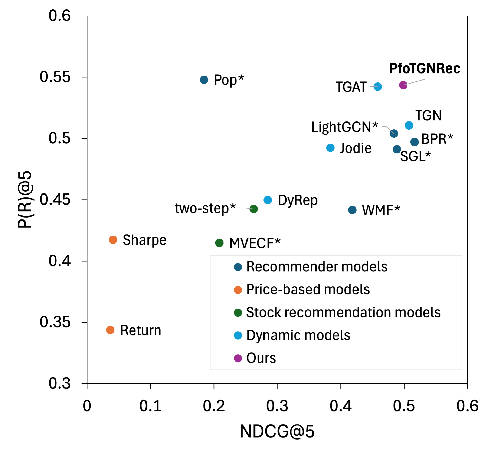
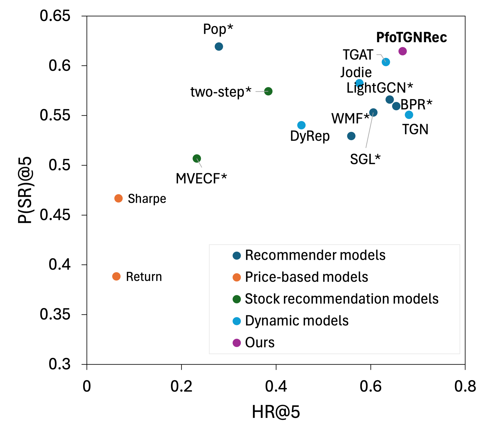
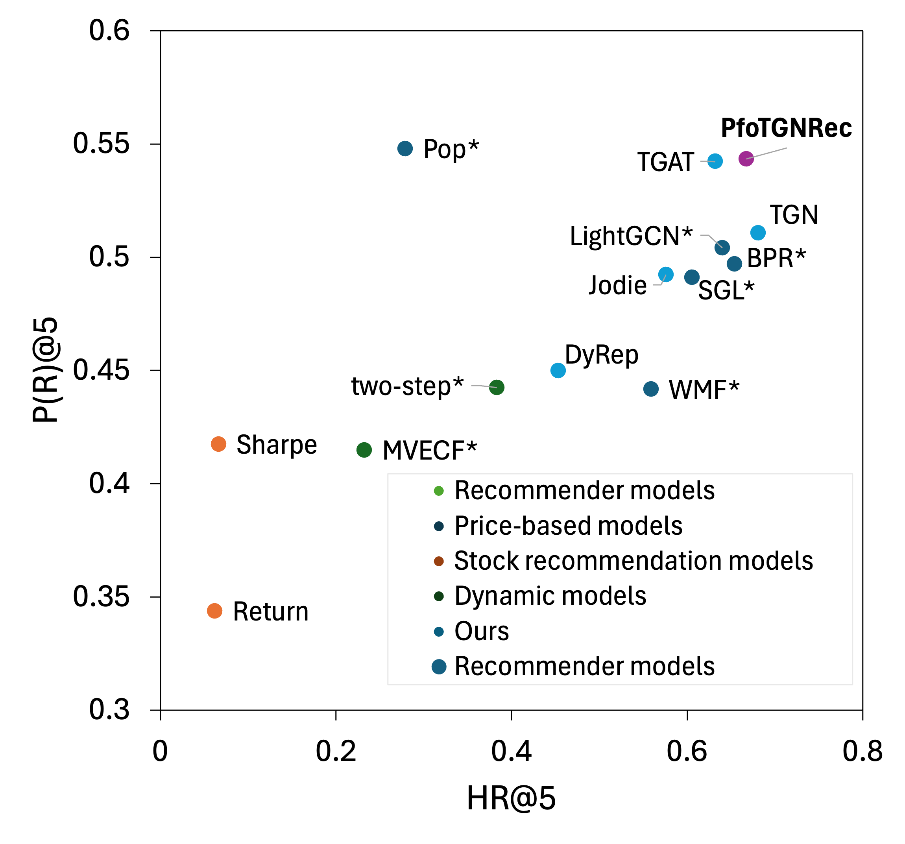
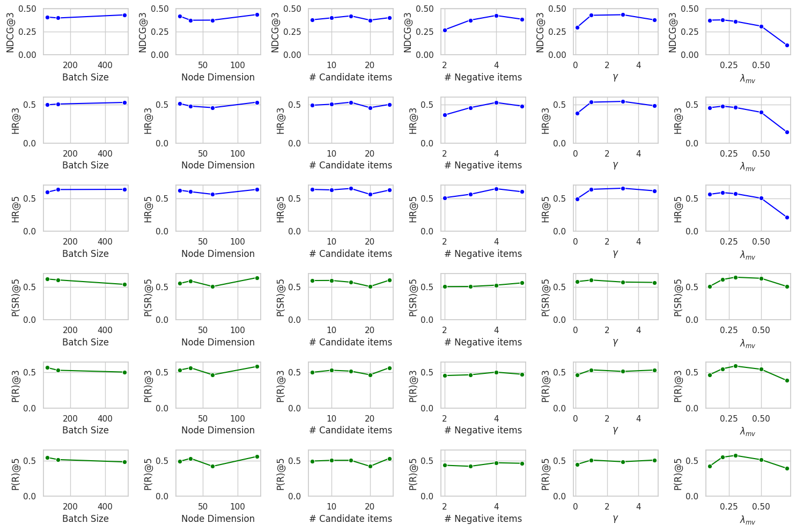

# Online Appendix

상태: 진행 중

### Comparison of Performance Considering Both Recommendation and Portfolio Performance

Although we visualized using two representative metrics, P(SR)@5 and NDCG@5, in main paper, it is also possible to represent this with various combinations of preferences and portfolio performance metrics. We visualized using HR@5 and NDCG@5 for user preference and P(R)@5 and P(SR)@5 for portfolio performance. As you see in below Figures, in all results, our model consistently produced plots that were positioned on the outermost edge, indicating superior performance.

### Hyperparameter Study

In the main paper, we illustrated the hyperparameter study using two representative metrics, P(SR)@5 and NDCG@5. However, it is feasible to conduct a hyperparameter study for other metrics as well. Therefore, we extended our analysis to include NDCG@3, HR@3, HR@5, P(SR)@5, P(R)@3, and P(R)@5. The results of this extended analysis are presented in the figure below.

Upon examining the results, it is evident that all hyperparameters exhibit similar trends across both the recommendation metrics and the investment metrics as observed with the two representative metrics. This consistency in the observed trends reinforces the reliability and generalizability of our findings across multiple evaluation criteria.

### Baseline Experiment Setting

- Recommender Models

For the static recommender models, we employed the RecBole Package, maintaining the same chronological data split (8:1:1), identical sub-datasets, and consistent random seeds to ensure reproducibility. For the recommendation and investment performance evaluations, we followed an interaction-based ranking strategy, utilizing the same evaluation code as ours.

The dynamic recommender models utilized the code from the TGN repository released by Twitter, with the sole modification of changing the loss to BPR for recommendations. Similar to the static recommender models, to adhere to the interaction-based ranking strategy, the same evaluation code as ours was used for the dynamic models.

- Price-based Models

We implemented Price-based Models focusing on Return and Sharpe Ratio. Our methodology involves fixing the last day of the training period as a reference point and calculating the daily log returns for each stock for the 30 days preceding this date. For each stock, we computed two key metrics: the Return ratio and the Sharpe ratio. Upon calculating these metrics, we then selected the top-k stocks exhibiting the highest return and Sharpe ratios.

- Stock Recommendation Models

We applied the renowned Fama-French five-factor model to the Greece stock market. This model is a cornerstone in understanding market dynamics and includes five key factors: Market Risk (Mkt), Small Minus Big (SMB), High Minus Low (HML), Robust Minus Weak (RMW), and Conservative Minus Aggressive (CMA).

- Market Risk (Mkt): Represents the excess market return over the risk-free rate.
- Small Minus Big (SMB): Captures the size premium, measuring the excess return of small-cap stocks over large-cap stocks.
- High Minus Low (HML): Indicates the value premium, reflecting the excess return of high book-to-market stocks over low book-to-market stocks.
- Robust Minus Weak (RMW): Focuses on profitability, quantifying the excess return of stocks with high operating profitability.
- Conservative Minus Aggressive (CMA): Reflects the investment premium, capturing the excess return of firms with conservative investment strategies.

Since there is no data for the Greece market on the official Fama-French factor model website, we used Greece market factor data from a study that analyzed global factors as a proxy. Specifically, we utilized factor themes corresponding to each of these factors, which were classified in the study.

To determine the beta values for each stock in our study, we conducted a regression analysis using daily return values. This analysis was based on 30 days preceding the final day of our training set. The regression assumed a risk-free rate of 0.

### Hyperparameter Tuning

- Recommender Models

We conducted hyperparameter tuning independently for each of the sub-datasets. Experiments with the BPR, LightGCN, and SGL models were performed using Recbole, a Python package designed for recommendation systems. For the experiments, we fixed the number of epochs at 20, the batch size at 512, the number of negative samples for training at 3, and the validation metric as NDCG@5.

In the case of the BPR model, we performed a grid search for the embedding size across 32, 64, and the learning rate across 0.01, 0.001. The best hyperparameters identified were an embedding size of 64 and a learning rate of 0.001.

For the SGL model, we explored a range of values for several key hyperparameters. The search range included SSL tau values of 0.1, 0.2, 0.5, and 1.0, drop ratios of 0, 0.1, 0.2, 0.4, and 0.5, and SSL weights of 0.005, 0.05, 0.1, 0.5, and 1.0. The best configuration was found to be a drop ratio of 0.5, an SSL tau of 0.2, and an SSL weight of 0.05.

For the LightGCN model, we performed a grid search over embedding sizes of 32, 64, and 128, learning rates of 0.01 and 0.001, regularization weights of 1e-4 and 1e-2, and the number of layers set to either 2 or 3. The optimal performance was achieved with an embedding size of 32, a learning rate of 0.01, 3 layers, and a regularization weight of 0.01.

Dynamic graph learning methods are experimented with 20 epochs, the number of negative samples for training at 3, and the validation metric as NDCG@5.

For the Jodie and DyRep models, we explored a range of hyperparameters to determine the best settings for each. The search range included memory dimensions of 32 and 64, a number of heads set to 2, learning rates of 1e-3 and 1e-2, batch sizes of 32, 64, 128, and 256, and dropout rates of 0, 0.2, and 0.4. The best parameters for Jodie were found to be a memory dimension of 32, a number of heads set to 2, a learning rate of 0.001, a batch size of 128, and a dropout rate of 0.4. In contrast, DyRep performed best with a memory dimension of 32, a number of heads set to 2, a learning rate of 0.001, a batch size of 64, and a dropout rate of 0.2.

For the TGAT and TGN models, the hyperparameter tuning was conducted over a slightly broader range. We performed a grid search within the memory dimensions of 32, 64, and 128, the number of heads set to 1, 2, and 4, learning rates of 1e-3 and 1e-2, batch sizes of 32, 64, 128, and 256, and dropout rates of 0, 0.2, and 0.4. Additionally, for TGAT and TGN, we specifically searched within the node dimensions of 64 and 128 and batch sizes of 32 and 64. The best parameters for TGAT were a memory dimension of 64, a number of heads set to 2, a learning rate of 0.001, a batch size of 128, and a dropout rate of 0.4. TGN performed optimally with a memory dimension of 64, a number of heads set to 2, a learning rate of 0.001, a batch size of 256, and a dropout rate of 0.2.

Our model follows the best hyperparameters of TGN, with the exception of $\lambda_{MV}$, which was searched separately. The search range for $\lambda_{MV}$ included 0.1, 0.2, 0.3, 0.4, 0.5, 0.6, and 0.7, with 0.1 being identified as the best parameter.

- Stock Recommendation Models

For the MVECF model experiments, we used a different search range because we worked with MVECF data and other datasets.

For the WMF model, the hyperparameter search included latent dimensions of 16, 32, 64, and 128, and regularization parameters of 1e-3, 1e-2, and 1e-1. The best performance was achieved with a latent dimension of 128 and a regularization parameter of 1e-1.

Similarly, for the two-step model, we explored latent dimensions of 16, 32, 64, and 128, and regularization parameters of 1e-3, 1e-2, and 1e-1. The optimal parameters were found to be a latent dimension of 128 and a regularization parameter of 1e-1.

The search range for the MVECF model included risk-aversion level $\gamma$ values of 1, 3, and 5; weight coefficients $c_{ui}$ values of 1, 5, and 10; and $\lambda_{MV}$ of 1e-10, 1e-5, and 1e-1. The best parameters identified were a gamma of 5, a $c_{ui}$ of 10, and a $\lambda_{MV}$of 1e-1.