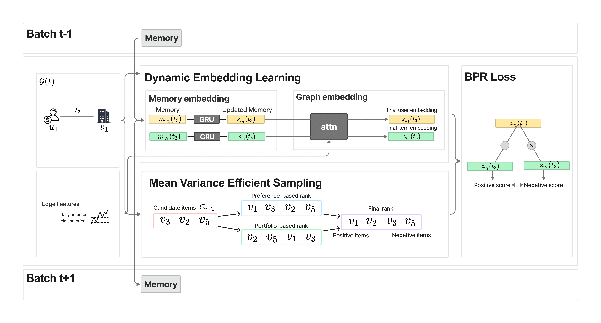

# Stock recommendation

The tricky point in stock recommendation is that recommendations should give good investment performance but also should not ignore individual preferences. To tackle this challenge, we propose **PfoTGNRec**, which can handle time-varying collaborative signals and incorporates mean-variance efficient sampling. 

We provide source code for (1) Dynamic graph learning models (including our model), (2) Recommendation models, and (3) Stock recommendation models.  

(1) **Dynamic graph learning models**

While most dynamic methods have not been utilized for recommendation tasks, we adapt their original architectures to recommendation task by incorporating negative sampling during training and applying BPR loss. The codes are implemented within the temporal graph network (TGN) framework by [Rossi et al, 2020](https://github.com/twitter-research/tgn). 

* **PfoTGNRec**: Our proposed model based on TGN that incorporates diversification-enhancing contrastive learning.
* *DyRep* ([Trivedi et al., 2019](https://openreview.net/forum?id=HyePrhR5KX)): learns representation over dynamic graphs as latent hidden process bridging two observed processes of Topological Evolution of and Interactions on dynamic graphs.
* *Jodie* ([Kumar et al., 2018](https://arxiv.org/abs/1908.01207)): models the future trajectory of nodes in an embedding space to predict user-item interactions in dynamic scenarios. 
* *TGAT* ([Xu et al., 2020](https://arxiv.org/abs/2002.07962)): incorporates a novel time encoding technique upon GAT which is a graph attention mechanism applied to static graphs. 

(2) **Recommendation models**

Collaborative filtering (CF) algorithms that capture user preferences based on user behaviors. The codes are implemented within the Recbole framework by [Zhao et al, 2021](https://github.com/RUCAIBox/RecBole).

* *BPR*: a personalized ranking based recommender.
* *WMF* : a matrix factorization based recommender.
* *LightGCN* : a graph convolution network based collaborative filtering method.
* *SGL* : a self-supervised graph learning approach which incorporates a contrastive loss into the classical supervised task of recommendation.

You can check the code used here in [baseline_rec](https://github.com/youngandbin/ICAIF2024/baseline_rec).

(3) **Stock recommendation models**

CF based models that take into account both individual preferences and portfolio diversification. We implement the two most advanced methods with the code used in [Chung et al, 2023](https://arxiv.org/abs/2306.06590).

- *two-step method* ([Swezey and Charron, 2018](https://arxiv.org/abs/2103.07768)): ranks items based on user preferences, and then re-ranks them based on the modern portfolio theory (MPT).
- *MVECF* ([Chung et al, 2023](https://arxiv.org/abs/2306.06590)): uses a ranking loss function based on the MPT into a matrix factorization model.

You can check the code used here in [baseline_stock_rec](https://github.com/youngandbin/ICAIF2024/baseline_stock_rec).

- - -

## Datasets

In the paper, we used individual investor transaction dataset obtained from *National Bank of Greece*. The datasets are available in [Google Drive](https://drive.google.com/drive/folders/1rvFOCIua8FJ3qAC1QViMSwp1epzwrwAy?usp=sharing). The data spans from January 2018 to November 2022. 

- - -

## How to Run

The experiment was conducted on `Python 3.10.11` and packages listed in [requirements.txt](https://github.com/youngandbin/ICAIF2024/blob/main/requirements.txt).

You can execute the following scripts:

* **DyRep**: Utilize [run_dyrep.sh](https://github.com/youngandbin/ICAIF2024/blob/main/run/run_dyrep.sh) to run DyRep model.

* **Jodie**: Utilize [run_jodie.sh](https://github.com/youngandbin/ICAIF2024/blob/main/run/run_jodie.sh) to run Jodie model.

* **TGAT**: Utilize [run_tgat.sh](https://github.com/youngandbin/ICAIF2024/blob/main/run/run_tgat.sh) to run Jodie model.

* **PfoTGNRec**: For our proposed method, PfoTGNRec, execute [run_ours.sh](https://github.com/youngandbin/ICAIF2024/blob/main/run/run_ours.sh)

* **PfoTGNRec w. hyperparameters**: If you wish to run our model with hyperparameter tuning, use [run_ours_hyper.sh](https://github.com/youngandbin/ICAIF2024/blob/main/run/run_ours_hyper.sh)

These scripts offer a convenient way to execute the dynamic graph learning models and evaluate the output at once. 

* **Recommendation models** : Utilize [run_baseline_rec.sh](https://github.com/youngandbin/ICAIF2024/blob/main/baseline_rec/run_baseline_rec.sh) to run, and utilize [run_baseline_rec_evaluation.sh](https://github.com/youngandbin/ICAIF2024/blob/main/baseline_rec/run_baseline_rec_evaluation.sh) to evaluate recommendation models

* **Stock recommendation models** : Utilize [run_baseline_stock_rec.sh](https://github.com/youngandbin/ICAIF2024/blob/main/baseline_stock_rec/run_baseline_stock_rec.sh) to run, and utilize [run_baseline_stock_rec_evaluation.sh](https://github.com/youngandbin/ICAIF2024/blob/main/baseline_stock_rec/run_baseline_stock_rec_evaluation.sh) to evaluate stock recommendation models
